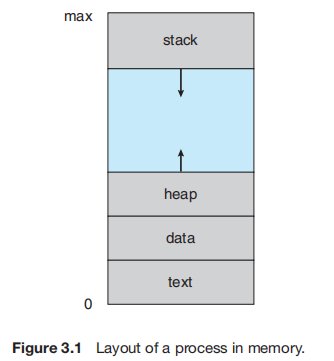

## Process

> A process is a program in execution.

#### **进程内存分布：**

* **Text Section 代码段** - 可执行代码

* **Data Section 数据段** - 全局变量，静态变量

* **Heap Section 扩展段（堆）** - 程序运行时动态申请的内存

* **Stack Section 运行时段（栈）** - 调用函数时，暂时的数据存储（函数参数、返回地址、局部变量）

#### **进程（process）和线程（thread）的区别：**

* 基本单位

    进程是对运行时程序的封装，是系统进行资源分配和调度的基本单位；线程是进程的子任务，是CPU调度和分派的基本单位；

    一个程序至少有一个进程，一个进程至少有一个线程；

* 资源分配
    
    进程在执行过程中拥有独立的内存单元（地址空间）；多个线程共享进程的内存；

    资源分配给进程；统一进程的多个线程共享**代码段、数据段、扩展段**，但每个线程拥有自己的**运行时段**（用于存储局部变量、临时变量）（见[进程内存分布](#进程内存分布)）

* 通信方式

    一个进程的多个线程之间可以通过传递地址/全局变量/静态变量的方式传递信息（不过需要处理好同步和互斥，见[线程同步](#线程同步)；而进程之间只能通过**[进程通信](#进程通信)**的方式进行；

* 开销大小

    对进程操作一般开销较大，进程**上下文切换**比线程上下文切换开销大，因为
        
    1. 需要记录进程状态（包括内存指针）和CPU寄存器的值；
        
    2. 需要切换虚拟内存空间，页目录、页表缓冲、寄存器都需要切换，在一段时间内导致内存访问比较低效（冷启动）；
    但线程切换过程中不会出现这个问题；

#### **进程通信**

1. **管道** 管道是单向的、

#### **线程同步**

