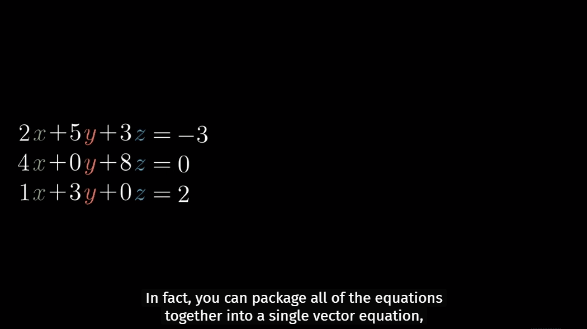
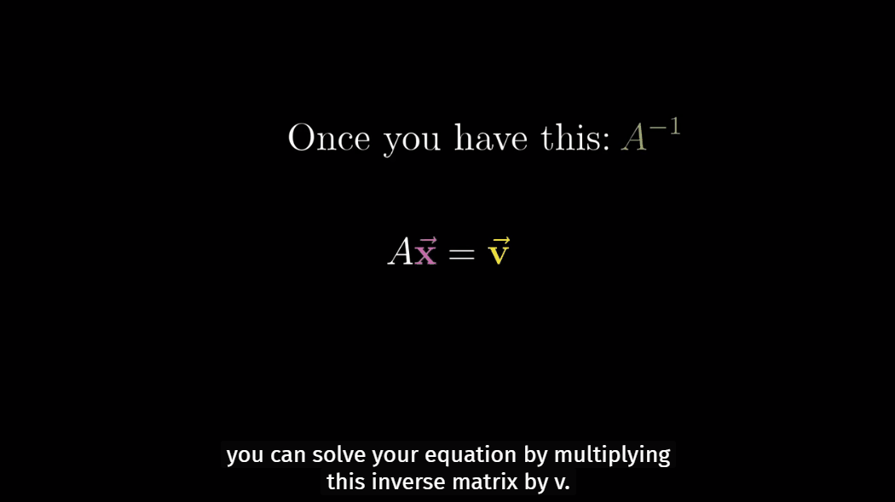

Based on a great series that introduce linear algebra [Essence of linear algebra - 3blue1brown][youtube-linear]. This blog covers [ch7][youtube-ch7].

# Equations Solving and Matrices
By now, you already have a hint for how matrix is used in describing the manipulation of space, which is useful for things like computer graphics and robotics. But one of the main reason that linear algebra is more broadly appicable, and required for just about any technical discipline, is that it lets us solve **linear systems of equations**(see [wiki][wiki-lse]).

We can package all equations together into a single vector equation, where we have the matrix containing all of the constant coefficients, and a vector containing all of the variables, and their matrix vector product equals some different constant vector.

Let's name that constant matrix $$A$$, denote the vector holding the variables with $$\vec{x}$$, and call the constant vector on the right-hand side $$\vec{v}$$. Now we can represent the system of equations with a single line:

$$A \vec{x} = \vec{v}$$

From a geometric prospective, solving the equation $$A \vec{x} = \vec{v}$$, means we're looking for a vector $$\vec{x}$$ which, after applying the transformation, lands on $$\vec{v}$$. We could subdivide into the case where $$A$$ has non-zero determinant, and the case where $$A$$ has zero determinant.

1.  $$der(A)$$ not equals to 0   
    In this (most-likely) case, we could find out the reverse transformation and play it on $$\vec{v}$$. And the reversed transformation corresponds to a matrix, which normally called the **"inverse of $$A$$"**, denoted by $$A^{-1}$$. The result of $$A^{-1} \times A$$, is the matrix that corresponds to doing nothing. The transformation that does nothing is called the **identity transformation**.
   
    Once you find this inverse, which, in practice, you do with a computer, you can solve your equation by multiplying this inverse matrix by $$\vec{v}$$:

    
$$\vec{x} = A^{-1} \vec{v} $$

    And you'll get a unique solution.

    

    For spaces of higher dimension, when the number of equations equals the number of unknowns, it's *almost* certainly the case that there's a single, unique solution, as long as the transformation $$A$$ doesn't squish all of space into a lower dimension (which means, determinant is non-zero). 

2.  $$der(A)$$ equals to 0  
    When the transformation associated with this system of equation squishes space into a smaller dimension, there is no inverse. You cannot unsquish a line to turn it into a plane. But still, it's possible that a solution exists. It's just that you have to be lucky enough that the $$\vec{v}$$ lives somewhere in the lower-dimensional space.

    

    You might notice that some of these zero determinant cases feel a lot more restrictive than others. Given a 3*3 matrix for example, it seems a lot harder for a solution to exist when it squishes space onto a line compared to when it squishes things onto a plane. We have some language that's a bit more specific, the **rank**.

# The Rank of Matrices
**Rank** is the number of dimensions in the output of a transformation. The set of all possible outputs for the matrix, whether it's a line, a plane, 3D space, whatever, is called the "**column space**" of the matrix. It has this name because the columns tell you where the basis vectors land, and the span of those transformed basis vectors gives you all possible outputs. So a more precise definition of rank would be that it's the number of dimensions in the column space.

When the rank is as high as it can be (equals the number of columns), we call the matrix "**full rank**". For matrices that aren't full rank, there would be sets of vectors that would, after transformation, land on the origin (i.e. zero vector). They're called the "**null space**" or the "**kernel**" of the matrix. 

# Conclusion
Consider the equation $$A \vec{x} = \vec{v}$$. The idea of column space lets us understand when a solution even exists. If $$\vec{v}$$ is out of the column space, there doesn't exist any solution. The idea of null space helps us understand what the set of all possible solutions can look like (when $$\vec{v}=0$$).

------

中文
------
------

# 线性方程组和矩阵

线性方程组可以用矩阵和向量乘法表示：$$A \vec{x} = \vec{v}$$。如果能找到矩阵（变换）$$A$$的逆矩阵（变换）$$A^{-1}$$，那么可以通过$$\vec{x} = A^{-1} \vec{v} $$获得方程组的解$$x$$。

那么，什么时候能找到逆矩阵呢？

答案是，当行列式不等于0的时候，即，空间经过变换之后没有降维；换言之，矩阵的所有列向量线性无关（注意，不止是“两两之间线性无关”）；再换言之，矩阵满秩。
   
[youtube-linear]: https://www.youtube.com/playlist?list=PLZHQObOWTQDPD3MizzM2xVFitgF8hE_ab
[youtube-ch7]: https://youtu.be/uQhTuRlWMxw
[wiki-lse]: https://en.wikipedia.org/wiki/System_of_linear_equations